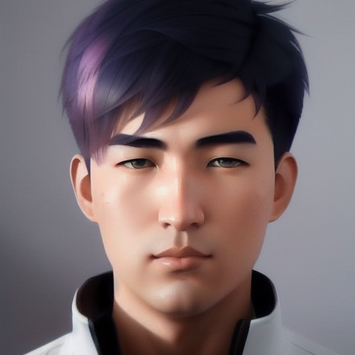

# Generate Studio Quality Realistic Photos of Myself By Kohya LoRA Stable Diffusion Training 
<p float="left">
  
  
  
  
  
</p>
<p float="left">
  
  
  
### Prompts

```
parameters

A portrait of Chwa a man<lora:Chws-000003:1> cute-fine-face, pretty face, realistic shaded Perfect face, find details, Anime. realistic shaded lighting by ilya Kuvshinov Gieuseppe Dangelico Pino and Michael Garmash and Rob Rey. IAMAG premiere. WLOP matte print, cuter freckles, materpice

Negative prompt: (blue eyes, semi-realistic, cgi, 3d, render, sketch, cartoon, drawing, anime:1.4), fat, text, cropped, out of frame, worst quality, low quality, jpeg artifacts, ugly, duplicate, morbid, mutilated, extra fingers, mutated hands, poorly drawn hands, poorly drawn face, mutation, deformed, blurry, dehydrated, bad anatomy, bad proportions, extra limbs, cloned face, disfigured, gross proportions, malformed limbs, missing arms, missing legs, extra arms, extra legs, fused fingers, too many fingers, long neck

Steps: 30, Sampler: DPM++ SDE Karras, CFG scale: 5, Seed: 1117571876, Size: 640x720, Model hash: c0d1994c73, Model: realisticVisionV20_v20

I changed the Gray color with other colors like red blue yellow etc.
```

### 2071 classification / regularization images of Realistic Vision 2
**https://www.patreon.com/posts/realistic-vision-82085317** 

### PDF file mentioned in the tutorial video:
**https://www.patreon.com/posts/kohya-ss-lora-82085260**

## Prerequisites

### Full tutorial for python and git installation with venv
**https://youtu.be/B5U7LJOvH6g**

### Full tutorial for how to install and use Stable Diffusion Automatic1111 Web UI: 
**1 - https://youtu.be/AZg6vzWHOTA**

**2 - https://youtu.be/aAyvsX-EpG4**

### Download and install Visual Studio 2015, 2017, 2019, and 2022 redistributable 
**https://aka.ms/vs/17/release/vc_redist.x64.exe**

### Download and install Python 3.10.9 and git
**1 - https://www.python.org/ftp/python/3.10.9/python-3.10.9-amd64.exe**

**2 - https://youtu.be/aAyvsX-EpG4**

### Other Links and Files

Kohya SS Gui Repo : https://github.com/bmaltais/kohya_ss 

Kohya commit id : 63657088f4c35a376dd8a936f53e9b9a3b4b1168

Realistic Vision V2 model file download link

https://civitai.com/api/download/models/29460 

Best VAE file to set as default to generate images

https://huggingface.co/stabilityai/sd-vae-ft-mse-original/blob/main/vae-ft-mse-840000-ema-pruned.ckpt 

cudnn 8.6 files for torch 1.12

https://b1.thefileditch.ch/mwxKTEtelILoIbMbruuM.zip

### Commands

```python .\tools\cudann_1.8_install.py```

```gui.bat --listen 127.0.0.1 --server_port 7860 --inbrowser```

set cuda visible devince only 1

```setx CUDA_VISIBLE_DEVICES 1``` 

```pip3 install torch==1.13.1 torchvision torchaudio --index-url https://download.pytorch.org/whl/cu117```

```pip install https://huggingface.co/MonsterMMORPG/SECourses/resolve/main/xformers-0.0.18.dev489-cp310-cp310-win_amd64.whl```

```--gpu_ids=1```
